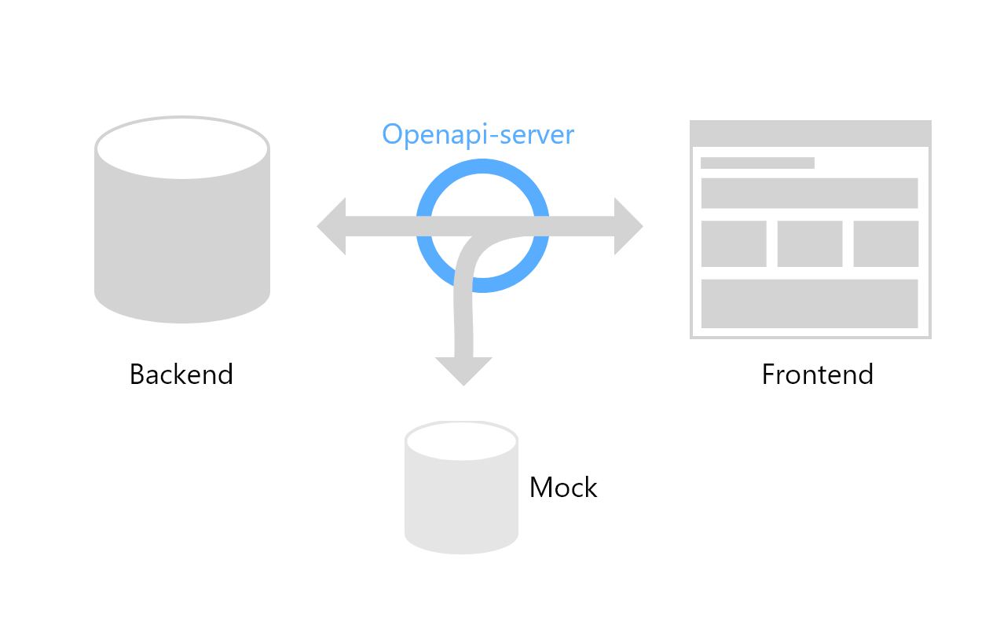

# Openapi server

It's a simple mock server for development purpose, which allows you to proxy requests to a real backend server.

Common use is when starting prototype a single page application, without a working backend. You should define API specs (using openapi), then you can start developing by mocking all services.  
When some real service becomes available, you can selectively disable mocks and proxy to backend.

You can also use mocks for testing purpose, as to run end-to-end tests with predictable api responses.

### Features

- configurable via env vars, env files and cli params
- validates openapi specs (both version 3 and 2, aka swagger) `yaml` format
- supports multiple spec files, also loads specs from directories, checking all defined paths and methods to avoid conflicts
- quick mocks, supporting .json files as wel as .js modules and express middlewares
- proxy requests to another server
- optionally validates responses
- static file server
- extensible via custom [express](https://expressjs.com/) middlewares
- supports http and https
- watch mode
- can be used programmatically, importing entire application or express router only



## Install

```
npm i https://gitlab.intesys.it/open-source/openapi-server.git
```

You can include it as dependency in your `package.json`:

```js
{
  // ...
  "devDependencies": {
    "openapi-server": "git+https://gitlab.intesys.it/open-source/openapi-server.git"
  }
  // ...
}
```

## Quick start

- run `npm i https://gitlab.intesys.it/open-source/openapi-server.git`
- place a file `api.yml` (openapi v.3, swagger v.2 is also supported) in the root folder of your project
- create a folder `/mocks` in the root folder of your project
- run `npx openapi-server`
- open your browser on `http://localhost:3000/api`

## Use

### From command line

```
npx openapi-server [options]
```

### As package.json script (recommended)

```js
{
  // ...
  "scripts": {
    "api": "openapi-server [options]"
  }
  // ...
}
```

### As express router

```typescript
import { app, router } from "openapi-server";
import express, { Application, Router } from "express";

// if you want to start server programmatically
app();

// if you want to configure your server and apply the router
const myApp: Application = express();

(async () => {
  const myRouter: Router = await router();
  myApp.use(myRouter);
  const myServer = myApp.listen();
})();
```

## Configuration

Configure the server in two ways:

### Configuration using CLI

CLI options take precedence over env variables.

```
Usage: index [options]

Options:
  -v, --version                     output version number
  -a,--API_YML [value]              api yml file / folder / list of file or folders
  -m,--MOCKS_PATH [value]           mocks path
  -l,--LOG                          enable console log
  -s,--SKIP_VALIDATION              turn off validation
  -w,--WATCH                        restart server on changes
  --API_PREFIX [value]
  --API_PORT [value]
  --API_PROTOCOL [value]            http and https are supported
  --API_HOSTNAME [value]
  --STATIC                          enable static file server
  --STATIC_PREFIX [value]           static files prefix
  --STATIC_PATH [value]             static files folder
  --PROXY                           enable proxy
  --PROXY_PROTOCOL [value]          http and https are supported
  --PROXY_HOSTNAME [value]
  --PROXY_PORT [value]
  --PROXY_PREFIX [value]
  --PROXY_FILTER_HEADERS            remove some headers, look below for details
  --VERBOSE [number]                depth of logs shown
  -h, --help                        output usage information
```

### Configuration using `.env` file

Place an `.env.{NODE_ENV}.local`, `.env.{NODE_ENV}` or `.env` file, with this variables (feel free to change values) :

```
# api endpoint used by frontend
API_PROTOCOL=http
API_HOSTNAME=localhost
API_PORT=3000
API_YML=/api.yml
API_PREFIX=/api
STATIC_PREFIX=/resources
MOCKS_PATH=/mocks

# backend endpoint used by nginx and proxy
PROXY_PROTOCOL=http
PROXY_HOSTNAME=localhost
PROXY_PORT=3001
PROXY_PREFIX=/api
PROXY_FILTER_HEADERS=false

# proxy configuration (development only)
SKIP_VALIDATION=false
LOG=false
VERBOSE=2
WATCH=false
```

> Note: place .env file(s) in the directory you use to launch server, because it looks for files in `process.cwd()` (_current working directory_)

### Defaults

API_YML: 'api/'  
API_PREFIX: '/api'  
API_PORT: '3000'  
API_PROTOCOL: 'http'  
API_HOSTNAME: 'localhost'

STATIC: false  
STATIC_PREFIX: '/resources'  
STATIC_PATH: '/resources'

MOCKS: true  
MOCKS_PATH: '/mocks'

PROXY: false  
PROXY_PROTOCOL: ''  
PROXY_HOSTNAME: ''  
PROXY_PORT: ''  
PROXY_PREFIX: ''  
PROXY_FILTER_HEADERS: false

SKIP_VALIDATION: false  
LOG: false  
VERBOSE: 2  
WATCH: false

## Mocks

Mocks are `.json` or `.js` files placed in the `MOCKS_PATH` directory.

Mocks are enabled by default. The only way to disable is using an ENV variable.

Mocks take precedence over proxy, if a mock is found for the requested route, it is served, otherwise the request is proxied to backend.

The MOCKS_PATH directory has a sub-folder structure which follows the paths to mock, as example:

```
// api.yml
...
paths:
  /route1:
    post:
      ...
    get:
      ...
  /route1/sub/route:
    get:
      ...
...
```

```
MOCKS_PATH folder:

/mocks
  /route1
    post.json
    get.json
    /sub
      /route
        get.js
```

### JSON mocks

Plain `Json` files are served as responses.

### JS mocks

Can write mocks as `.js` files (`.ts` are not allowed, because mocks are required at runtime and can't be transpiled).

#### Mocks as node modules

A `.js` mock can be a standard node module exporting the response object:

```javascript
// node module mock

const generatorFunction = () => ({
  // ...response
});

module.exports = generatorFunction();
```

#### Mocks as express middlewares

If a `.js` mock exports a function, it's supposed to be an express middleware and is invoked with express signature. It MUST write the response in the `res.locals.body` object and MUST call `next()` when ends.

```javascript
// express middleware mock

const middleware = (req, res, next) => {
  // ...some logic, can access to req and res objects

  // MUST put the response into res.locals.body
  res.locals = {
    body: {
      // ...response
    },
  };

  next(); // MUST be called
};

module.exports = middleware;
```

## Static resources

If `STATIC` is set to true, files contained on `STATIC_PATH` are served on `STATIC_PREFIX`.

## Extending mock server

If `MOCKS` are enabled (default), you can add a `__middlewares__` folder in mocks directory, exporting one or two [express](https://expressjs.com/) middlewares: `pre.js` and `post.js`. They will be mounted before and after any other middleware, enabling to intercept all requests and respnses.

You can use it to decorate all requests or to define custom routes, not described in openapi spec.

Examples:

```javascript
// pre.js and post.js

const express = require("express");
const router = express.Router();

// Decorate all requests
router.use((req, res, next) => {
  console.log("called pre-middleware");
  next();
});

// Define a custom route, not included in openapi spec
router.get("/custom-route", (req, res) => {
  console.log("called custom route");
  res.send("Response sent by custom route");
});

// Execute post-request tasks
router.use((req, res, next) => {
  next();
  console.log("post request task");
});

module.exports = router;
```

### Exporting an async function

You can also export an async function, which MUST resolve to an express router or middleware.

```javascript
// post.js
// using Parcel to build and watch your single page application

// Parcel intercepts all routes and redirects to an index,
// so must be used after other routers
// to prevent it intercepting valid mocked or proxyied routes

const Bundler = require("parcel-bundler");

const entrypoint = "public/index.html";

const options = {
  open: false,
  outDir: "dist/",
  publicUrl: "/",
};

const build = async (file, options = {}) => {
  const bundler = new Bundler(file, options);
  const parcelMiddleware = await bundler.middleware();
  return new Promise((resolve, reject) => {
    bundler.on("bundled", () => resolve(parcelMiddleware));
    bundler.on("buildError", error => reject(error));
  });
};

module.exports = async () => build(entrypoint, options);
```

**Note: you can't export a regular function returning a Promise, MUST export an `async` function!**

## Proxy

Proxy is disabled by default. To enable it, use --PROXY flag in CLI or set `PROXY=true` in `.env` file.

When proxy is enabled, all valid requests which doesn't have a mock are forwarder to proxy.

### PROXY_FILTER_HEADERS

Some server may not accept some proxied requests. In this case it could be useful to filter some headers. This can be done by setting `PROXY_FILTER_HEADERS` to `true`.

> Look at [https://github.com/postmanlabs/postman-request#proxies](https://github.com/postmanlabs/postman-request#proxies)

Removes these headers:

```
accept
accept-charset
accept-encoding
accept-language
accept-ranges
cache-control
content-encoding
content-language
content-length
content-location
content-md5
content-range
content-type
connection
date
expect
max-forwards
pragma
proxy-authorization
referer
te
transfer-encoding
user-agent
via
```

## How it works

Openapi-server is an [express](https://expressjs.com/) web server with some middleware, it:

- validates the openapi file
- configure routes based on openapi paths
- at every request:
  - looks for a mock (replies with mock if found)
  - proxies the request to the backend server
  - (optional) validates the response


## Dev hints

- Use "npm run start" for testing the openapi-server script, watch out for "basePath" in .yaml Api Configurations